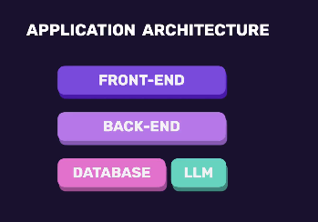

# AI Powered App

This project is a starting point for building an AI powered application using course code from Mosh Hamedani's AI Powered App series.

## Overview

This repository is intended to contain the frontend and backend code for an AI powered app that uses a modern JavaScript stack and an AI service such as OpenAI, Azure OpenAI, or another text-generation API.

## Key Features

- AI-powered prompt input and response output
- Local development environment
- Environment variable configuration for API keys
- Production build support
- Clear project structure for frontend and backend

## Prerequisites

- Node.js 18 or later
- npm or yarn
- An OpenAI-compatible API key (or equivalent AI service key)

## Setup

1. Open the project folder:
   ```bash
   cd /home/ali--salhab/Desktop/AiPowerdApp
   ```
2. Install dependencies:
   ```bash
   npm install
   ```
   or
   ```bash
   yarn install
   ```
3. Create an environment file:
   ```bash
   cp .env.example .env
   ```
4. Add your AI service API key to `.env`.

## Common Environment Variables

Use the values that match your implementation. Example:

```env
OPENAI_API_KEY=your-api-key-here
PORT=3000
```

If your app uses a different backend provider, update the environment variables accordingly.

## Running the App

Start the development server:

```bash
npm run dev
```

or

```bash
yarn dev
```

Then open your browser at:

```text
http://localhost:3000
```

## Build and Production

Build the app for production:

```bash
npm run build
```

Start the production server:

```bash
npm start
```

## Project Structure

A common AI app structure looks like this:

```
AiPowerdApp/
├── package.json
├── README.md
├── .env.example
├── /src
│   ├── App.js
│   ├── index.js
│   └── components/
├── /server
│   ├── index.js
│   ├── routes/
│   └── services/
```

Adjust the structure to match your course code.

## How to Use

1. Enter a prompt or question in the app interface.
2. Submit the prompt to the AI.
3. View the AI response in the page.

## Notes

- If you are following Mosh's course, use his starter files and replace this README with details from your specific project setup.
- Make sure your AI key is kept secret and never committed to source control.

## Troubleshooting

- If `npm install` fails, update Node.js to the latest stable version.
- If the app cannot connect to the AI service, verify your API key and network settings.

## License

This project is a personal learning project. Update the license information as needed.


# Topics 

## fundations 
   - what is llms (large language models)
   - how to use them and what can do 
## AI Enginer :
   how to use AI models to solve probelms
   Essentials AI Skills 
   1. LargeLanguageModel (LLMs)
   2. prompt Enginering 
   3. Retrival-Augmented Generation (RAG)
   4. vector Databases and sematic search 
   5. Building agents 
   #### whats is  LLms ? 
    - A system thats trained yo understand and generate human kanguage 
    Examples : GPT GROK Llama
   
   